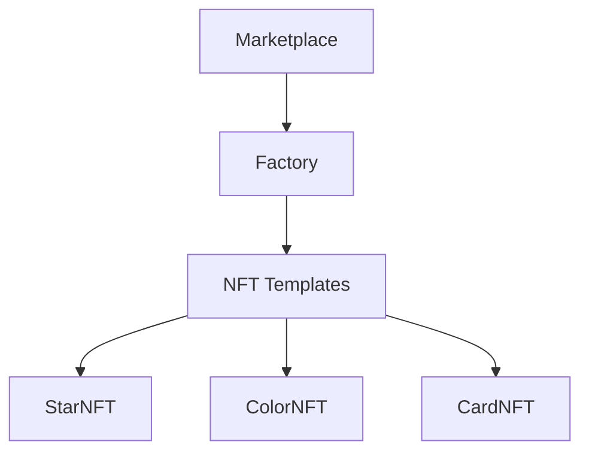

# NFT P2P Marketplace 🌌

[](https://opensource.org/licenses/MIT)

Универсальная платформа для создания и торговли NFT с динамическим ценообразованием и использованием Chainlink VRF.

## Авторы 
- **Белоконь Михаил**
- **Исаев Матвей**

## Архитектура 


## Ключевые особенности
- Универсальный шаблон для NFT коллекций
- Динамическое добавление новых типов NFT
- Алгоритмическое ценообразование с bonding curve
- Децентрализованная генерация случайности (VRF)

## Основные контракты 

### Marketplace (`Marketplace.sol`)
```solidity
contract Marketplace {
    // Основные операции
    function mintNFT(string memory nftType) external payable;
    function listNFT(uint256 tokenId, string memory nftType) external;
    function buyNFT(bytes32 listingId) external payable;
    function returnNFT(bytes32 listingId) external;
    
    // Управление
    function addNewNftToMarket(address newNFT) public onlyOwner;
    function calculatePrice(bytes32 listingId) public view returns (uint256);
}
```

### Factory (`NFTFactory.sol`)
```solidity
contract NFTFactory {
    // NFT Management
    function createNFT(string memory nftType, address to, uint256 randomness) external;
    function addNewNFT(address newNFT) public onlyOwner;
    
    // Информация
    function getBasePrice(string memory nftType, uint256 tokenId) external view returns (uint256);
}
```

### NFT Template (`MarketNFT.sol`)
```solidity
abstract contract MarketNFT is ERC721 {
    // Основные функции
    function mint(address to, Info memory data) public onlyOwner;
    function generateInfo(uint256 randomness) public virtual returns (Info memory);
    
    // Метаданные
    function tokenURI(uint256 tokenId) public view override returns (string memory);
}
```

## Механизм работы 

### Минт NFT
1. Пользователь вызывает `mintNFT` с указанием типа
2. Система запрашивает случайные числа через Chainlink VRF
3. После верификации генерируется уникальный NFT
4. Токен автоматически добавляется в Marketplace

```solidity
// Пример минта StarNFT
marketplace.mintNFT("StarNFT", {value: currentPrice});
```

### Динамическое ценообразование
```math
Price = BasePrice × \begin{cases} 
CurveExp^{(Minted - Listed)} & \text{if } TotalMinted ≤ 10000 \\
CurveExp^{Listed} & \text{otherwise}
\end{cases}
```

Где:
- `BasePrice`: Рассчитывается для каждого NFT индивидуально
- `CurveExp`: Параметр кривой для типа NFT (устанавливается при создании коллекции)

## Добавление новых NFT 
1. Создать контракт, наследуя `MarketNFT`
2. Реализовать логику генерации метаданных
3. Зарегистрировать в Factory через `addNewNFT`

```solidity
// Пример добавления новой коллекции
marketplace.addNewNftToMarket(address(newCustomNFT));
```

## Технологический стек 
- **Chainlink VRF** - Децентрализованная генерация случайности
- **ERC-721** - Стандарт NFT
- **UUPS Proxies** - Обновляемая логика
- **ReentrancyGuard** - Защита от атак
- **Hardhat** - Тестирование и деплой

## Безопасность 
- Проверки владельца для критических операций
- Защита от повторного входа (nonReentrant)
- Валидация входящих параметров
- Система комиссий (2.5% с каждой сделки)

## Деплой в сеть Sepolia 
Актуальные адреса контрактов в тестовой сети:
- **CardNFT**: [`0xb736812da21dDbb852434DA6F5a8802345985142`](https://sepolia.etherscan.io/address/0xb736812da21dDbb852434DA6F5a8802345985142)
- **StarNFT**: [`0x5D49a6D4308cC320484cc38649e8572234A6e4D2`](https://sepolia.etherscan.io/address/0x5D49a6D4308cC320484cc38649e8572234A6e4D2)
- **ColorNFT**: [`0x9e0d62da9dBC52b9760FF2AC978A558e31eEAbfe`](https://sepolia.etherscan.io/address/0x9e0d62da9dBC52b9760FF2AC978A558e31eEAbfe)
- **Marketplace**: [`0x083F02dBB9eC60D23aA31769399b02c8418448B4`](https://sepolia.etherscan.io/address/0x083F02dBB9eC60D23aA31769399b02c8418448B4)
- **FactoryNFT**: [`0x5a0C4C814ebd8F3679C951343A6c05fDd1eFE934`](https://sepolia.etherscan.io/address/0x5a0C4C814ebd8F3679C951343A6c05fDd1eFE934)
- **Proxy**: [`0x3973a4b3b34c1D4330b0cc2c9Ff7504Fd61bd728`](https://sepolia.etherscan.io/address/0x3973a4b3b34c1D4330b0cc2c9Ff7504Fd61bd728)
